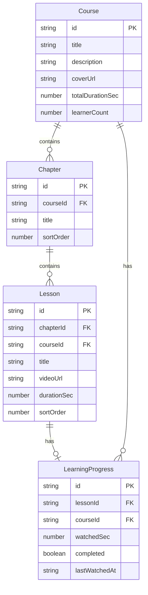

## 1. 架构设计

```mermaid
graph TB
    "前端层 React 18" --> "路由层 React Router v6"
    "路由层 React Router v6" --> "页面组件"
    "页面组件" --> "状态管理 Zustand"
    "页面组件" --> "数据请求 TanStack Query"
    "数据请求 TanStack Query" --> "Mock API 层"
    "页面组件" --> "UI层 Ant Design 5"
    "页面组件" --> "视频层 Video.js"
    "状态管理 Zustand" --> "localStorage 持久化"
```

## 2. 技术说明

- **前端框架**：React 18 + TypeScript
- **路由**：React Router v6
- **状态管理**：Zustand（含 localStorage 持久化用于学习进度）
- **UI 组件库**：Ant Design 5
- **视频播放**：Video.js
- **数据请求**：TanStack Query（管理服务端状态与缓存）
- **构建工具**：Vite
- **样式方案**：CSS Modules
- **后端**：无后端，使用 Mock 数据模拟 API
- **数据存储**：localStorage 模拟持久化

## 3. 路由定义

| 路由 | 用途 |
|------|------|
| `/` | 课程列表页 |
| `/course/:courseId` | 课程详情页 |
| `/course/:courseId/lesson/:lessonId` | 视频播放页 |
| `/learning` | 学习记录页 |

## 4. 数据模型

### 4.1 数据模型定义



### 4.2 核心类型定义

```typescript
interface Course {
  id: string;
  title: string;
  description: string;
  coverUrl: string;
  totalDurationSec: number;
  learnerCount: number;
  chapters: Chapter[];
}

interface Chapter {
  id: string;
  courseId: string;
  title: string;
  sortOrder: number;
  lessons: Lesson[];
}

interface Lesson {
  id: string;
  chapterId: string;
  courseId: string;
  title: string;
  videoUrl: string;
  durationSec: number;
  sortOrder: number;
}

interface LearningProgress {
  lessonId: string;
  courseId: string;
  watchedSec: number;
  completed: boolean;
  lastWatchedAt: string;
}
```

## 5. API 定义（Mock）

| API | 方法 | 描述 |
|-----|------|------|
| `/api/courses` | GET | 获取课程列表 |
| `/api/courses/:courseId` | GET | 获取课程详情（含章节目录） |
| `/api/progress/:courseId/:lessonId` | GET | 获取某节学习进度 |
| `/api/progress` | POST | 上报学习进度（watchedSec） |
| `/api/learning-records` | GET | 获取学习记录列表 |
